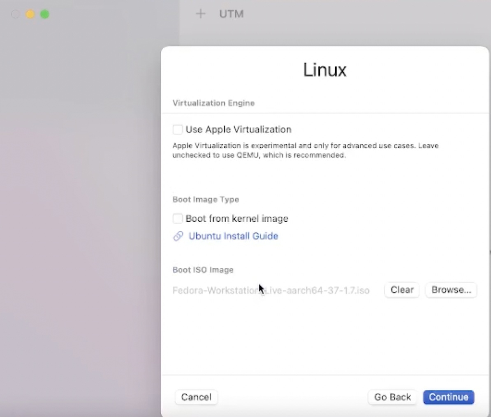
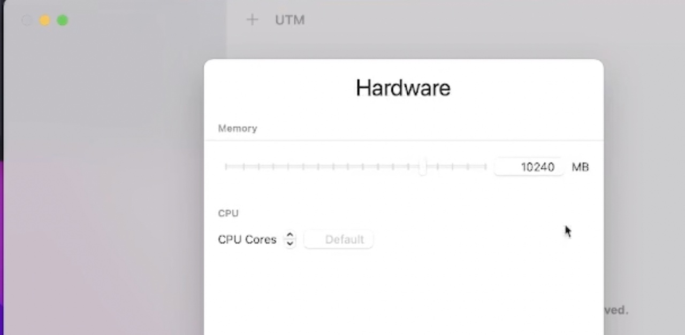
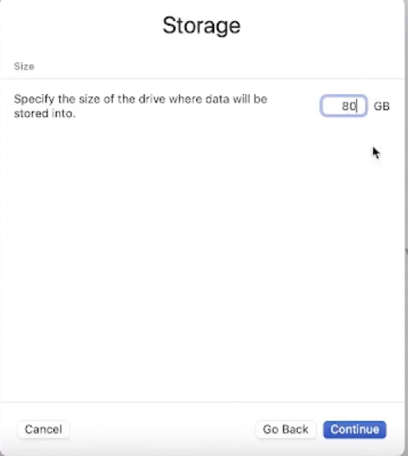
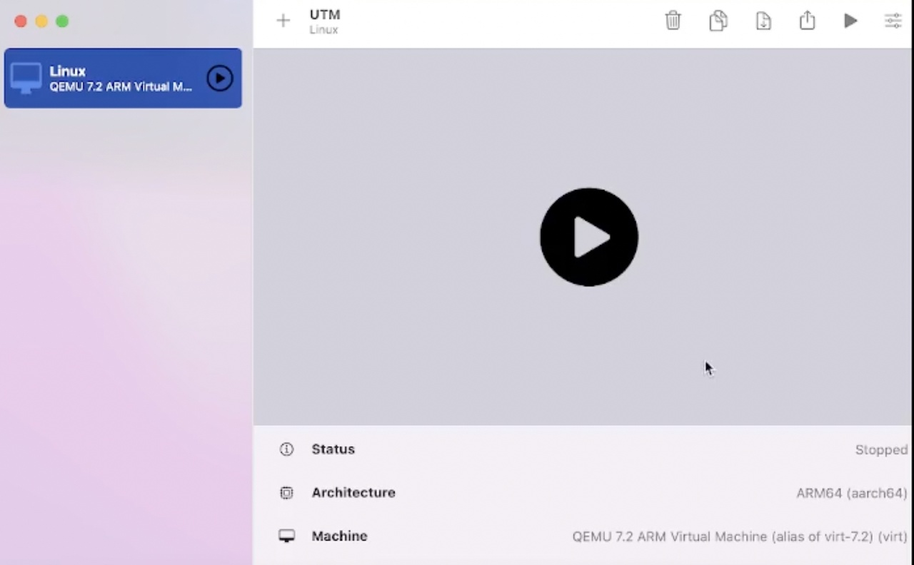
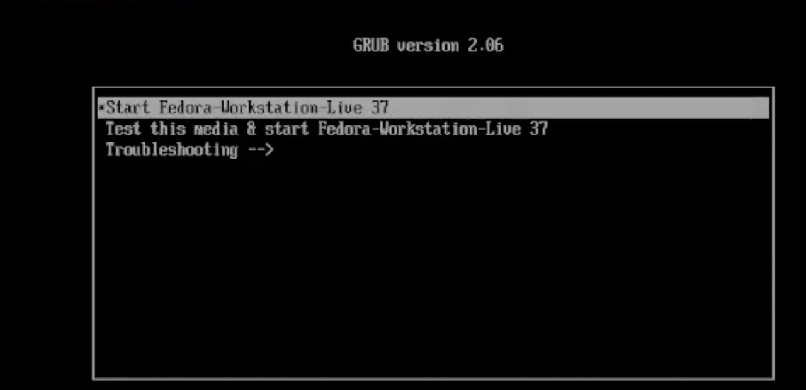
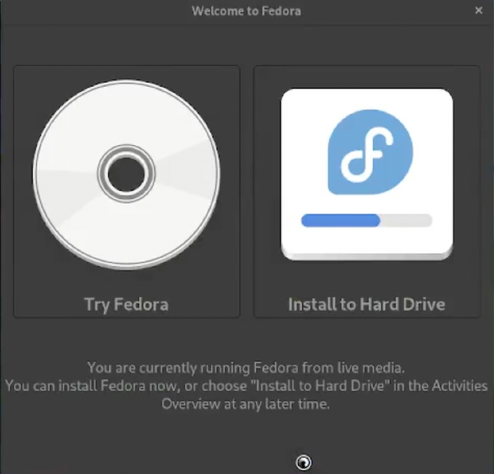
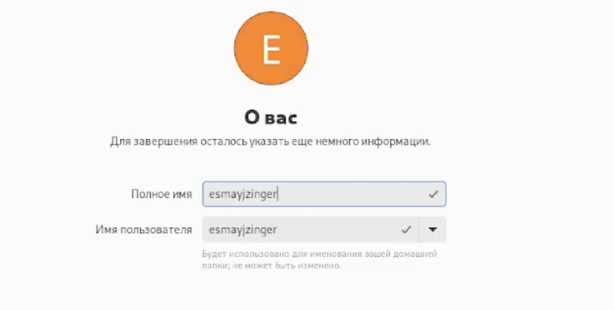
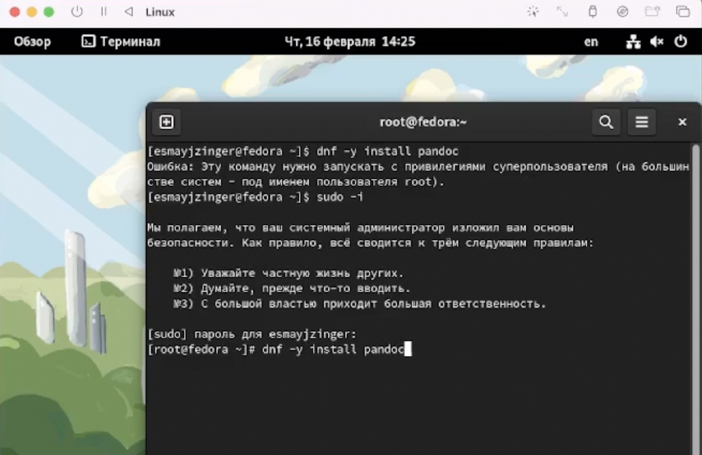
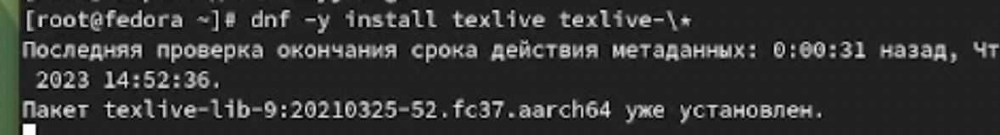
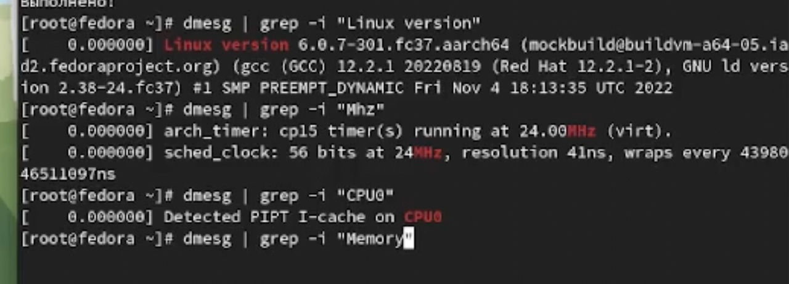

---
## Front matter
title: "Лабораторная работа 1"
subtitle: "Установка ОС Linux"
author: "Майзингер Эллина"

## Generic otions
lang: ru-RU
toc-title: "Содержание"

## Bibliography
bibliography: bib/cite.bib
csl: pandoc/csl/gost-r-7-0-5-2008-numeric.csl

## Pdf output format
toc: true # Table of contents
toc-depth: 2
lof: true # List of figures
lot: true # List of tables
fontsize: 12pt
linestretch: 1.5
papersize: a4
documentclass: scrreprt
## I18n polyglossia
polyglossia-lang:
  name: russian
  options:
	- spelling=modern
	- babelshorthands=true
polyglossia-otherlangs:
  name: english
## I18n babel
babel-lang: russian
babel-otherlangs: english
## Fonts
mainfont: PT Serif
romanfont: PT Serif
sansfont: PT Sans
monofont: PT Mono
mainfontoptions: Ligatures=TeX
romanfontoptions: Ligatures=TeX
sansfontoptions: Ligatures=TeX,Scale=MatchLowercase
monofontoptions: Scale=MatchLowercase,Scale=0.9
## Biblatex
biblatex: true
biblio-style: "gost-numeric"
biblatexoptions:
  - parentracker=true
  - backend=biber
  - hyperref=auto
  - language=auto
  - autolang=other*
  - citestyle=gost-numeric
## Pandoc-crossref LaTeX customization
figureTitle: "Рис."
tableTitle: "Таблица"
listingTitle: "Листинг"
lofTitle: "Список иллюстраций"
lotTitle: "Список таблиц"
lolTitle: "Листинги"
## Misc options
indent: true
header-includes:
  - \usepackage{indentfirst}
  - \usepackage{float} # keep figures where there are in the text
  - \floatplacement{figure}{H} # keep figures where there are in the text
---

# Цель работы

Целью данной работы является приобретение практических навыков установки операционной системы на виртуальную машину, настройки минимально необходимых для дальнейшей работы сервисов.

# Задание

Установить ОС Linux на VM

# Теоретическое введение
-

# Выполнение лабораторной работы

## Создание VM

На курсе АК мы уже устанавливали VM, поэтому перейдем сразу к созданию машины, выбираем образ ISO (рис. [-@fig:001]).
Устанавливаем необходимые настройки (рис. [-@fig:002]) и (рис. [-@fig:003])

{#fig:001 width=70%}

{#fig:002 width=70%}

{#fig:003 width=70%}

{width=70%}

## Запуск ВМ 
Запускаем виртуальную машину (рис. [-@fig:005]) и устанавливаем федору (рис. [-@fig:006])

{#fig:005 width=70%}

{#fig:006 width=70%}

## Настройка федоры 
После запуска и установки, переходим к настройке: язык русский, выбираем диск и создаем пользователя) (рис. [-@fig:007]) , (рис. [-@fig:008]) и (рис. [-@fig:009])

{#fig:005 width=70%}

{#fig:006 width=70%} 

{#fig:005 width=70%}

После всех настроек возвращаемся к виртуальной машине и изымаем образ

## Установка нужного обеспечения

После изъятия образа запускаем ВМ и заходим в терминал 

Там мы устанавливаем пандок (рис. [-@fig:010])и текстлив (рис. [-@fig:011])

{#fig:010 width=70%} 

{#fig:011 width=70%} 

## Выполнение ДЗ

С помощью команды dmesg | grep -i "то, что ищем" (рис. [-@fig:012])

НА МАКБУКЕ НЕЛЬЗЯ ПОЛУЧИТЬ ВСЮ ИНФУ

Получаем следующую информацию.
Версия ядра Linux (Linux version).
Частота процессора (Detected Mhz processor).
Модель процессора (CPU0).
Объём доступной оперативной памяти (Memory available).
Тип обнаруженного гипервизора (Hypervisor detected).
Тип файловой системы корневого раздела.
Последовательность монтирования файловых систем

{#fig:012 width=70%}  

## Ответы на кр вопросы 

    1. Какую информацию содержит учётная запись пользователя?

    Имя, пароль, авктивность
    2. Укажите команды терминала и приведите примеры:
    o для получения справки по команде; команда — helр
    o для создания / удаления каталогов / файлов;
    mkdir – создание каталога
    touch – создание файлов
    rm –r – удаление папки
    o для просмотра истории команд. - history

    3. Что такое файловая система? Приведите примеры с краткой характеристикой.
    Файловая система – это инструмент, позволяющий операционной системе и программам обращаться к нужным файлам и работать с ними. Примеры
    • Ext2;
    • Ext3;
    • Ext4;
    • JFS;
    • ReiserFS;
    • XFS;
    • Btrfs;
    • ZFS.
    4. Как посмотреть, какие файловые системы подмонтированы в ОС?
    Команда findmnt

    5. Как удалить зависший процесс?
    Ctrl+Z

# Выводы

В ходе работы была установлена ОС Линукс

# Список литературы{.unnumbered}

::: {#refs}
:::
