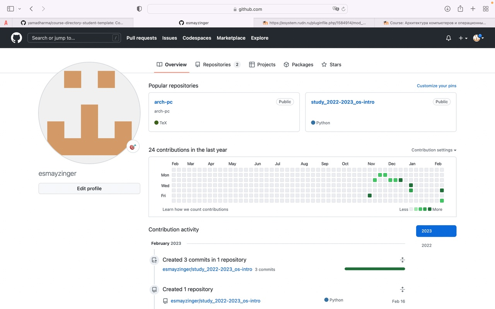
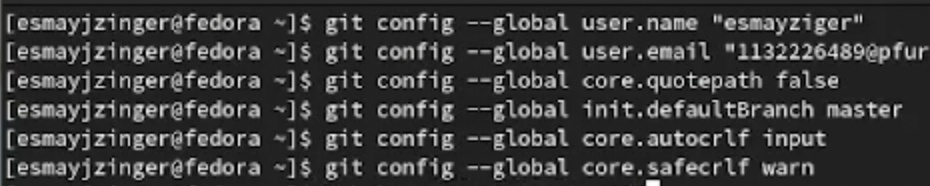
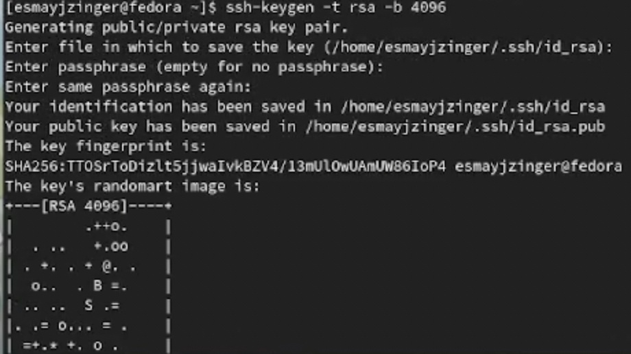
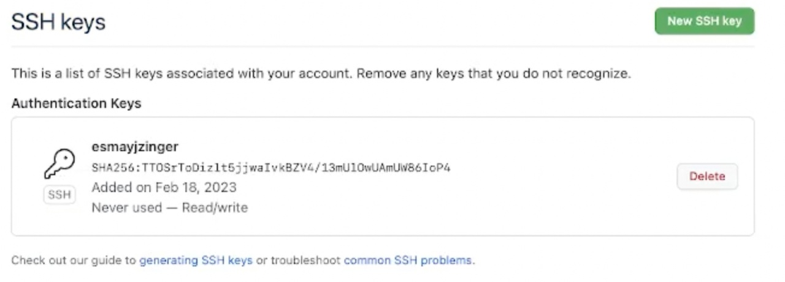
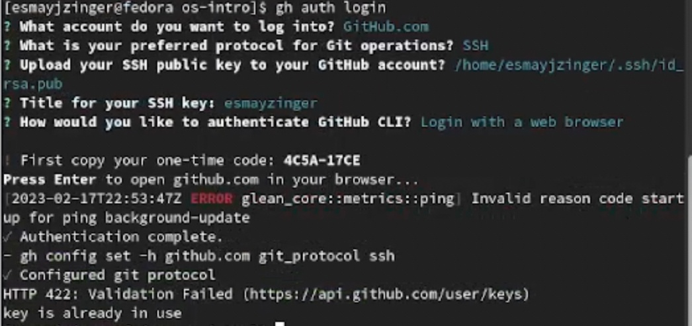
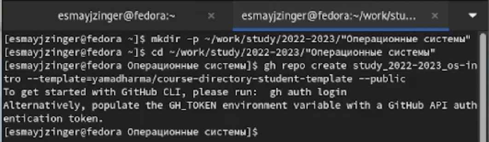
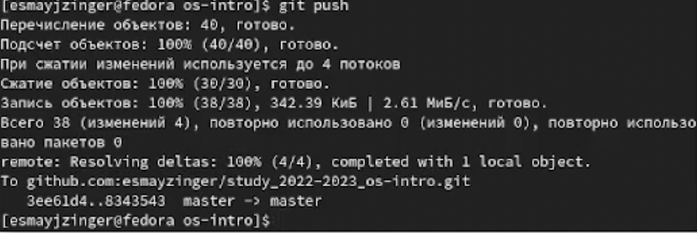

---
## Front matter
lang: ru-RU
title: Лабораторная работа 2
subtitle: Первоначальная настройка git
author:
  - Майзингер Эллина Сергеевна
institute:
  - Российский университет дружбы народов, Москва, Россия
date: 21.01.2023

## i18n babel
babel-lang: russian
babel-otherlangs: english

## Formatting pdf
toc: false
toc-title: Содержание
slide_level: 2
aspectratio: 169
section-titles: true
theme: metropolis
header-includes:
 - \metroset{progressbar=frametitle,sectionpage=progressbar,numbering=fraction}
 - '\makeatletter'
 - '\beamer@ignorenonframefalse'
 - '\makeatother'
---

# Ход работы 

## Создание аккаунта в гитхабе

На курсе "Архитектура компьютеров" был создан аккаунт 
{width=60%}

## Базовая настройка git

{width=60%}

## Создание ssh ключа

{width=30%}
{width=30%}

## Авторизация на гитхаб через терминал

{width=60%}

## Клонируем репозиторий

{width=60%}

## Настройка каталога курса

{width=60%} 

## Отправка изменений на гитхаб

{width=60%}

# Вывод

В ходе работы мы научились взаимодействовать с сервисом гитхаб

## {.standout}

Спасибо за внимание!

