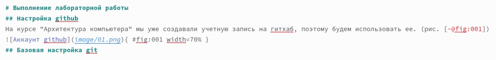
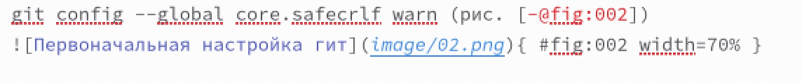
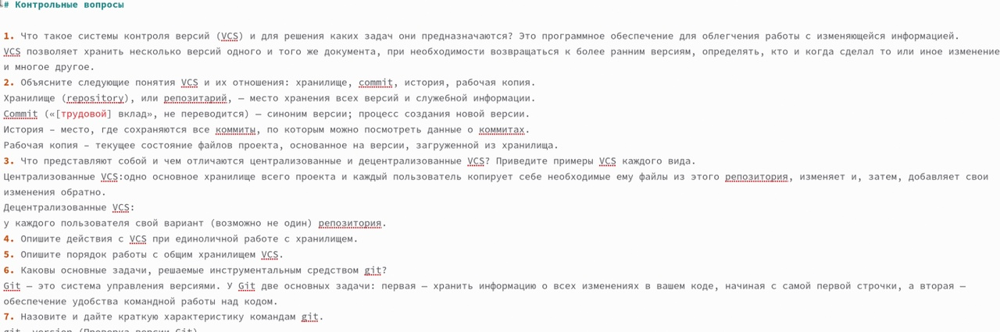
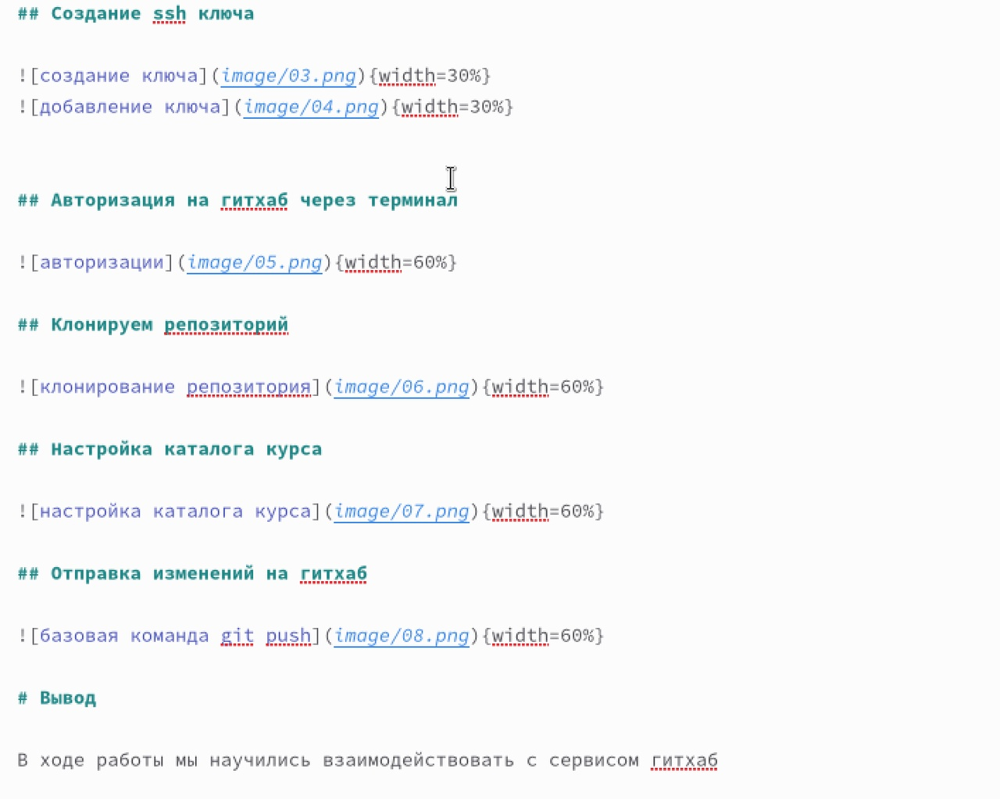
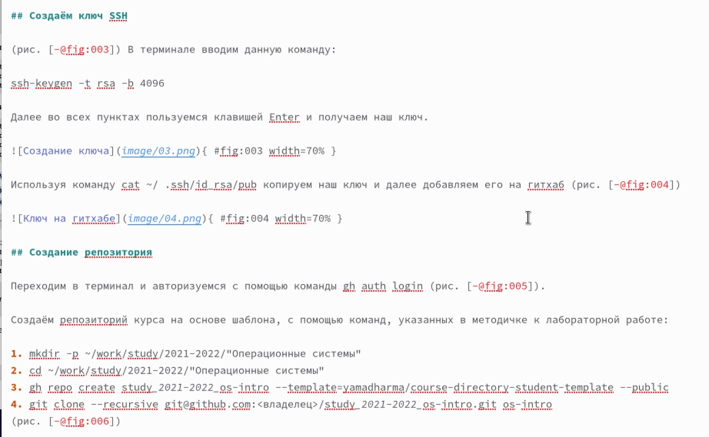
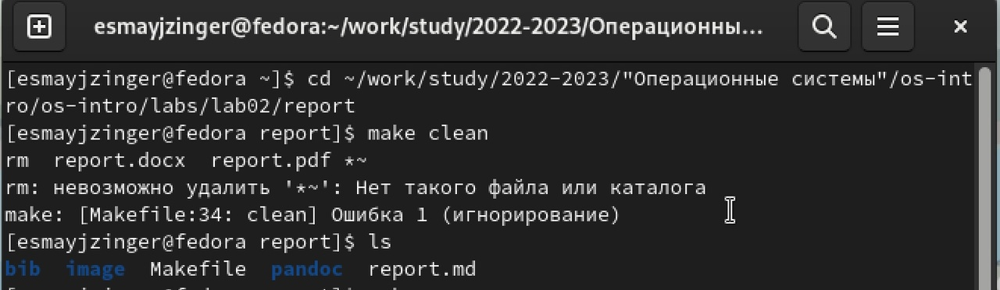
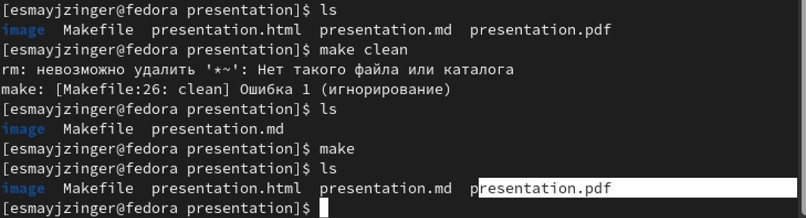
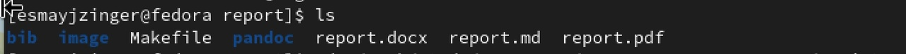

---
## Front matter
lang: ru-RU
title: Лабораторная работа 3
subtitle: Оформление отчета в markdown
author:
  - Майзингер Э. С.
institute:
  - Российский университет дружбы народов, Москва, Россия
date: 21.02.2023

## i18n babel
babel-lang: russian
babel-otherlangs: english

## Formatting pdf
toc: false
toc-title: Содержание
slide_level: 2
aspectratio: 169
section-titles: true
theme: metropolis
header-includes:
 - \metroset{progressbar=frametitle,sectionpage=progressbar,numbering=fraction}
 - '\makeatletter'
 - '\beamer@ignorenonframefalse'
 - '\makeatother'
---

# Цели и задачи

Научиться без труда подготавливать отчёт по лабораторным работам, а также познакомиться
с основными возможностями разметки Markdown.

# Ход работы 

## Использование заголовков разного уровня 
Для того, чтобы создать отчет, я использовала заголовки разного уровня. Количество хештегов = уровню заголовков(т.e. если перед заголовком стоит один хештэг - заголовок первого уровня, если два - второго и т.д...) 

{ width=70% }

## Прикрепляем картиночки ( с ссылочками!)

Синтаксис Markdown для встроенной ссылки состоит из части [link text] ,представляющей текст гиперссылки, и части (file-name.md) – URL-адреса или имени файла, на который дается ссылка. 

{ width=70% }

## Используем нумерацию 

Чтобы создать нумерованный список, мы делаем все как в обычном текстовом редакторе(цифра с точкой)

{ width=70% }

## Описываем ход работы 

Для описания хода работы, как и в отчете, так и в презентации, я использовала заголовки 2-го уровня и фотографии с ссылками, так же нумерованный список 

{ width=30% }

{ width=30% } 

## Форматируем отчет и презентацию в терминале 

Для этого используем команду "make", но так как я уже до этого создавала отчеты, я использовала команду "make clean", чтобы удалить раннее созданные файлы, после создаю их снова и с помощью команды "ls" проверяю получила ли я нужные файлы. 

{ width=20% }

{ width=20% }  

{ width=20% } 

# Выводы

В ходе работы были созданы отчет и презентация в формате мд

