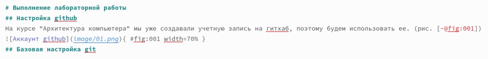
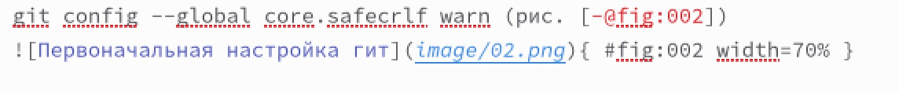
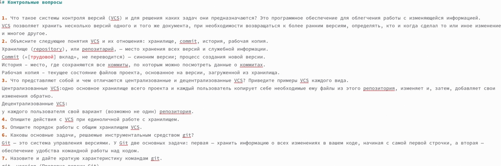
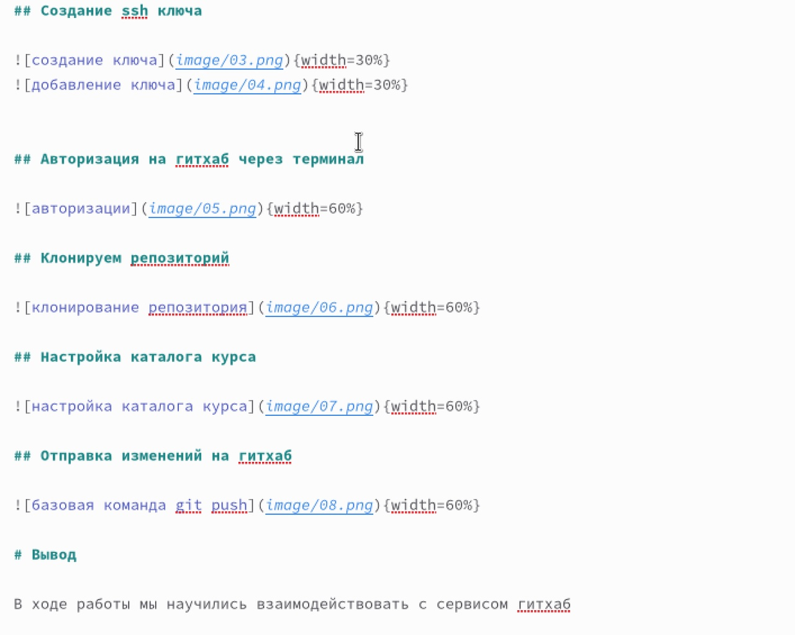
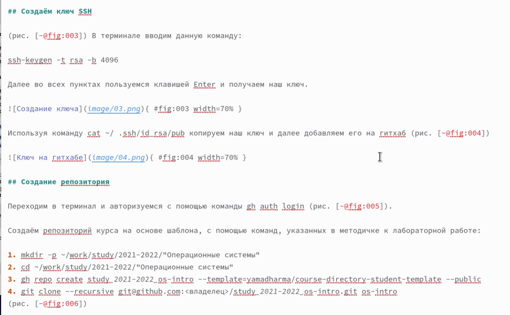
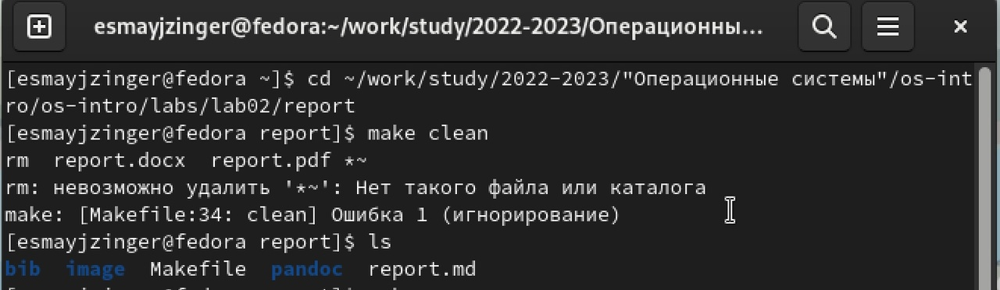
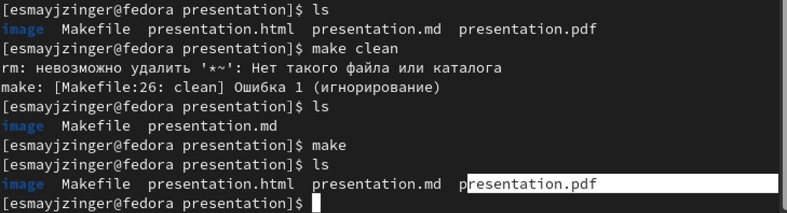
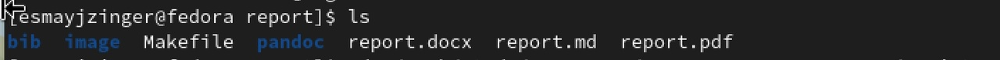

---
## Front matter
title: "Лабораторная работа 3"
subtitle: "Оформление отчета в markdown"
author: "Майзингер Эллина Сергеевна"

## Generic otions
lang: ru-RU
toc-title: "Содержание"

## Bibliography
bibliography: bib/cite.bib
csl: pandoc/csl/gost-r-7-0-5-2008-numeric.csl

## Pdf output format
toc: true # Table of contents
toc-depth: 2
lof: true # List of figures
lot: true # List of tables
fontsize: 12pt
linestretch: 1.5
papersize: a4
documentclass: scrreprt
## I18n polyglossia
polyglossia-lang:
  name: russian
  options:
	- spelling=modern
	- babelshorthands=true
polyglossia-otherlangs:
  name: english
## I18n babel
babel-lang: russian
babel-otherlangs: english
## Fonts
mainfont: PT Serif
romanfont: PT Serif
sansfont: PT Sans
monofont: PT Mono
mainfontoptions: Ligatures=TeX
romanfontoptions: Ligatures=TeX
sansfontoptions: Ligatures=TeX,Scale=MatchLowercase
monofontoptions: Scale=MatchLowercase,Scale=0.9
## Biblatex
biblatex: true
biblio-style: "gost-numeric"
biblatexoptions:
  - parentracker=true
  - backend=biber
  - hyperref=auto
  - language=auto
  - autolang=other*
  - citestyle=gost-numeric
## Pandoc-crossref LaTeX customization
figureTitle: "Рис."
tableTitle: "Таблица"
listingTitle: "Листинг"
lofTitle: "Список иллюстраций"
lotTitle: "Список таблиц"
lolTitle: "Листинги"
## Misc options
indent: true
header-includes:
  - \usepackage{indentfirst}
  - \usepackage{float} # keep figures where there are in the text
  - \floatplacement{figure}{H} # keep figures where there are in the text
---

# Цель работы

Научиться без труда подготавливать отчёт по лабораторным работам, а также познакомиться
с основными возможностями разметки Markdown.

# Задание

Сделать отчет к предыдущей лабораторной работе в md 

# Теоретическое введение

Markdown поддерживает как встраивание фрагментов кода в предложение, так и их размещение между предложениями в виде отдельных огражденных блоков. Огражденные блоки кода — это простой способ выделить синтаксис для фрагментов кода.

# Выполнение лабораторной работы

## Использование заголовков разного уровня 
Для того, чтобы создать отчет, я использовала заголовки разного уровня. Количество хештегов = уровню заголовков(т.e. если перед заголовком стоит один хештэг - заголовок первого уровня, если два - второго и т.д...) (рис. [-@fig:001])

{ #fig:001 width=70% }

## Прикрепляем картиночки ( с ссылочками!)

Синтаксис Markdown для встроенной ссылки состоит из части [link text] ,представляющей текст гиперссылки, и части (file-name.md) – URL-адреса или имени файла, на который дается ссылка. (рис. [-@fig:002]) 

{ #fig:002 width=70% }

## Используем нумерацию 

Чтобы создать нумерованный список, мы делаем все как в обычном текстовом редакторе(цифра с точкой) (рис. [-@fig:003]) 

{ #fig:003 width=70% }

## Описываем ход работы 

Для описания хода работы, как и в отчете, так и в презентации, я использовала заголовки 2-го уровня и фотографии с ссылками, так же нумерованный список 
(рис. [-@fig:004]) и (рис. [-@fig:005])

{ #fig:004 width=70% }

{ #fig:005 width=70% } 

## Форматируем отчет и презентацию в терминале 

Для этого используем команду "make", но так как я уже до этого создавала отчеты, я использовала команду "make clean", чтобы удалить раннее созданные файлы, после создаю их снова и с помощью команды "ls" проверяю получила ли я нужные файлы. (рис. [-@fig:006]) и (рис. [-@fig:007]) и (рис. [-@fig:008]) 

{ #fig:006 width=70% }

{ #fig:007 width=70% }  

{ #fig:008 width=70% } 

# Выводы

Здесь кратко описываются итоги проделанной работы.

# Список литературы{.unnumbered}

esystem rudn
