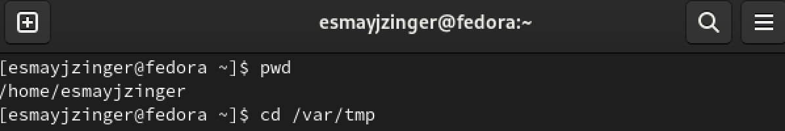
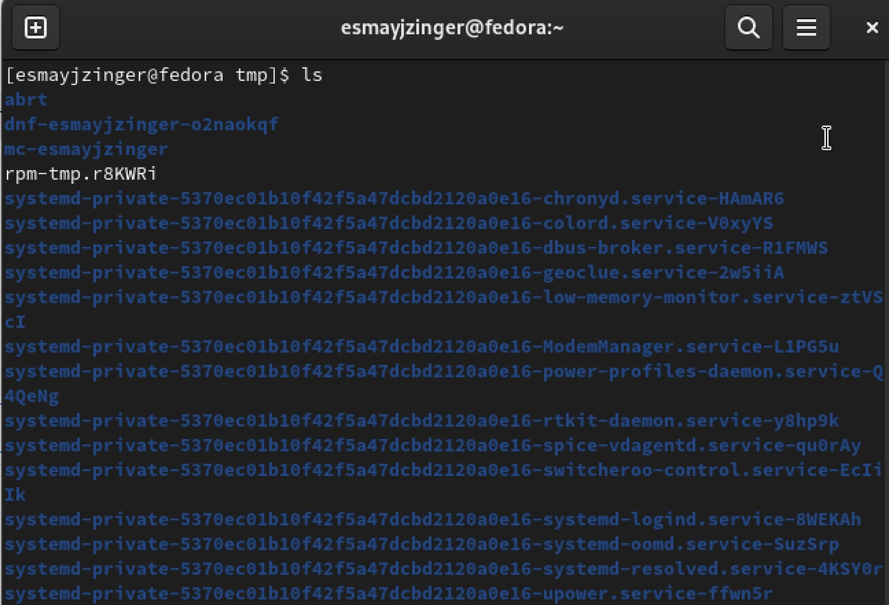
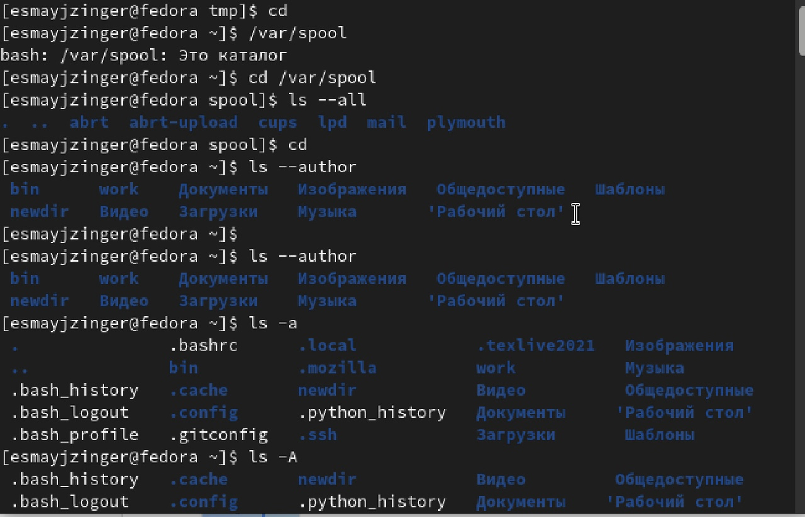
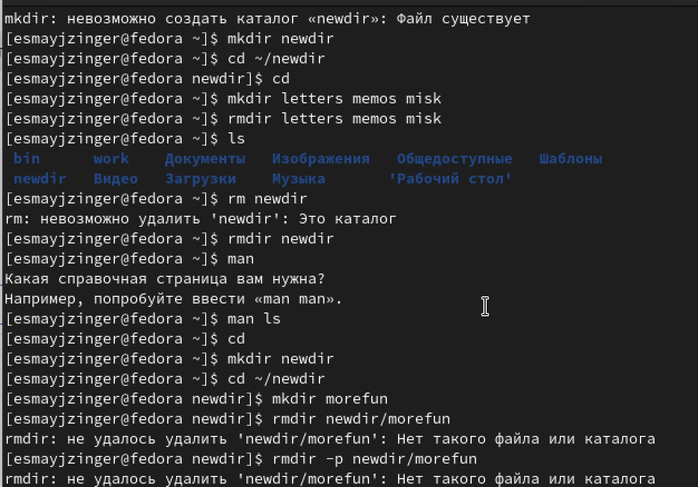
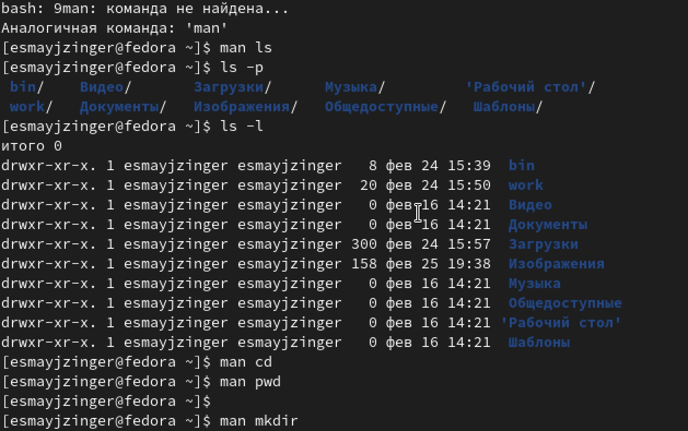
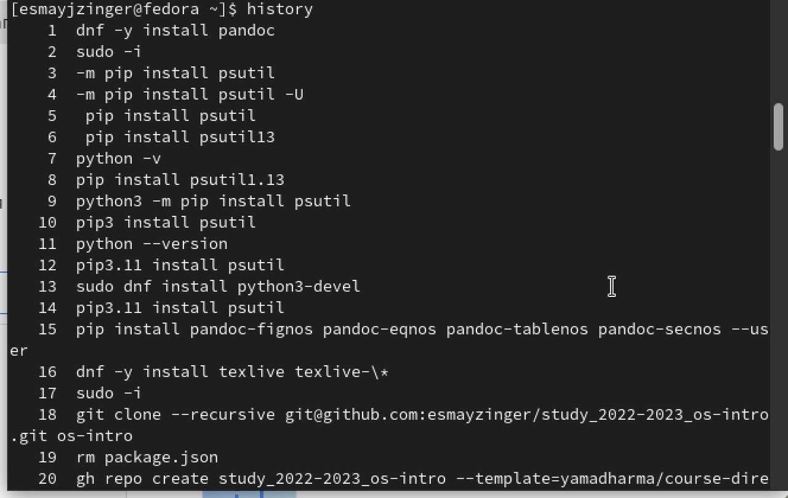

---
## Front matter
title: "Лабораторная работа 4"
subtitle: "Основы интерфейса взаимодействия
пользователя с системой Unix на уровне командной строки"
author: "Майзингер Эллина Сергеевна"

## Generic otions
lang: ru-RU
toc-title: "Содержание"

## Bibliography
bibliography: bib/cite.bib
csl: pandoc/csl/gost-r-7-0-5-2008-numeric.csl

## Pdf output format
toc: true # Table of contents
toc-depth: 2
lof: true # List of figures
lot: true # List of tables
fontsize: 12pt
linestretch: 1.5
papersize: a4
documentclass: scrreprt
## I18n polyglossia
polyglossia-lang:
  name: russian
  options:
	- spelling=modern
	- babelshorthands=true
polyglossia-otherlangs:
  name: english
## I18n babel
babel-lang: russian
babel-otherlangs: english
## Fonts
mainfont: PT Serif
romanfont: PT Serif
sansfont: PT Sans
monofont: PT Mono
mainfontoptions: Ligatures=TeX
romanfontoptions: Ligatures=TeX
sansfontoptions: Ligatures=TeX,Scale=MatchLowercase
monofontoptions: Scale=MatchLowercase,Scale=0.9
## Biblatex
biblatex: true
biblio-style: "gost-numeric"
biblatexoptions:
  - parentracker=true
  - backend=biber
  - hyperref=auto
  - language=auto
  - autolang=other*
  - citestyle=gost-numeric
## Pandoc-crossref LaTeX customization
figureTitle: "Рис."
tableTitle: "Таблица"
listingTitle: "Листинг"
lofTitle: "Список иллюстраций"
lotTitle: "Список таблиц"
lolTitle: "Листинги"
## Misc options
indent: true
header-includes:
  - \usepackage{indentfirst}
  - \usepackage{float} # keep figures where there are in the text
  - \floatplacement{figure}{H} # keep figures where there are in the text
---

# Цель работы

Приобретение практических навыков взаимодействия пользователя с системой по-
средством командной строки.

# Задание

1. Определите полное имя вашего домашнего каталога. Далее относительно этого ката-
лога будут выполняться последующие упражнения.
2. Выполните следующие действия:
2.1. Перейдите в каталог /tmp.
2.2. Выведите на экран содержимое каталога /tmp. Для этого используйте команду ls
с различными опциями. Поясните разницу в выводимой на экран информации.
2.3. Определите, есть ли в каталоге /var/spool подкаталог с именем cron?
2.4. Перейдите в Ваш домашний каталог и выведите на экран его содержимое. Опре-
делите, кто является владельцем файлов и подкаталогов?
3. Выполните следующие действия:
3.1. В домашнем каталоге создайте новый каталог с именем newdir.
3.2. В каталоге ~/newdir создайте новый каталог с именем morefun.
3.3. В домашнем каталоге создайте одной командой три новых каталога с именами
letters, memos, misk. Затем удалите эти каталоги одной командой.
3.4. Попробуйте удалить ранее созданный каталог ~/newdir командой rm. Проверьте,
был ли каталог удалён.
3.5. Удалите каталог ~/newdir/morefun из домашнего каталога. Проверьте, был ли
каталог удалён.
4. С помощью команды man определите, какую опцию команды ls нужно использо-
вать для просмотра содержимое не только указанного каталога, но и подкаталогов,
входящих в него.
5. С помощью команды man определите набор опций команды ls, позволяющий отсорти-
ровать по времени последнего изменения выводимый список содержимого каталога
с развёрнутым описанием файлов.
6. Используйте команду man для просмотра описания следующих команд: cd, pwd, mkdir,
rmdir, rm. Поясните основные опции этих команд.
7. Используя информацию, полученную при помощи команды history, выполните мо-
дификацию и исполнение нескольких команд из буфера команд.

# Теоретическое введение

В операционной системе типа Linux взаимодействие пользователя с системой обычно
осуществляется с помощью командной строки посредством построчного ввода ко-
манд. 

# Выполнение лабораторной работы

## Работаем с домашним каталогом 

Определяем имя домашнего каталогa с помощью команды pwd. Переходим в каталог tmp и с помощью команды ls смотрим что в нем содержитcя. (рис. [-@fig:001]) и (рис. [-@fig:002])

{#fig:001 width=70%}

{#fig:002 width=70%}  

С помощью разных опций команды ls определяем есть ли у нас файл cron в каталоге spool, так же определяем владельца файлов и каталогов  (рис. [-@fig:003])

{#fig:003 width=70%}

## Создание и удаление каталогов 

С помощью команды mkdir мы создаем несколько каталогов в нашем домашнем каталоге

С помощью команды rmdir мы можем удалить созданные нами каталоги 

Команда rm не может удалить каталог (рис. [-@fig:004])

{#fig:004 width=70%}

## Команда man 

С помощью команды man определяем функции и работу команду ls, pwd, mkdir (рис. [-@fig:005])

{#fig:005 width=70%}

## Команда history 

С помощью команды history можем смотреть и пользоваться ранее использованными командами (рис. [-@fig:006])

{#fig:006 width=70%}

# Выводы

В ходе работы мы приобрели практические навыки взаимодействия пользователя с системой по-средством командной строки.

# Контрольные вопросы

#Контрольные вопросы
    1. Что такое командная строка?
Строка в которую мы вводим команды
    2. При помощи какой команды можно определить абсолютный путь текущего каталога? Приведите пример.
pwd home/esmayjzinger
    3. При помощи какой команды и каких опций можно определить только тип файлов и их имена в текущем каталоге? Приведите примеры. ls 
    4. Каким образом отобразить информацию о скрытых файлах? Приведите примеры. ls -a
    5. При помощи каких команд можно удалить файл и каталог? Можно ли это сделать одной и той же командой? Приведите примеры. rmdir - удаление директории (если она пустая) rm - удаление файлов 
    6. Каким образом можно вывести информацию о последних выполненных пользователем командах? работы? histoty
    7. Как воспользоваться историей команд для их модифицированного выполнения? Приведите примеры. histoty
    8. Приведите примеры запуска нескольких команд в одной строке. mkdir dir1 & cd dir
    9. Дайте определение и приведите примера символов экранирования. *Экранирование — это способ заключения в кавычки одиночного символа.
Экранирующий (escape) символ () сообщает интерпретатору,
что следующий за ним символ должен восприниматься как обычный символ.*
    10. Охарактеризуйте вывод информации на экран после выполнения команды ls с опцией l. 
    11. Что такое относительный путь к файлу? Приведите примеры использования относительного и абсолютного пути при выполнении какой-либо команды. Eсли имя объекта начинается на « / » — это полный путь, в любом другом случае — относительный.
    12. Как получить информацию об интересующей вас команде?
ввести “help –команда”
    13. Какая клавиша или комбинация клавиш служит для автоматического дополнения вводимых команд? Ctrl+Alt+T — запускает окно терминала на активном рабочем столе.
Alt+F2 — откроется окно «Выполнить», где достаточно вписать «lxterminal» и подтвердить кнопкой Ok.
Ctrl+Alt+(F1-F6) — откроется системная консоль (можно запустить до шести консолей одновременно), графическим аналогом которой и является терминал. Хотя эти комбинации относятся к системным, а не к терминалу, но с их помощью также можно получить доступ к режиму ввода команд.
Ctrl+Alt+F7 — возврат из консоли на рабочий стол.
Win+T — вызов терминала в Linux Ubuntu с рабочим окружением XFCE.

# Список литературы{.unnumbered}

::: {#refs}
:::
